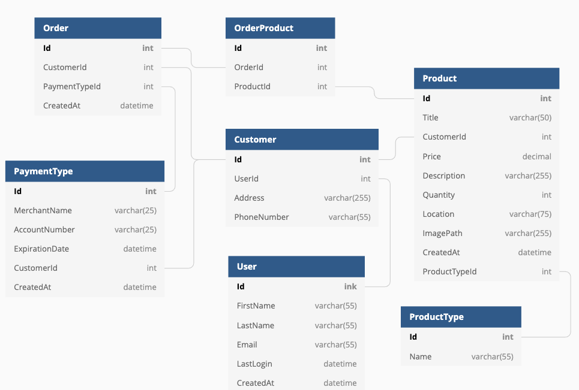
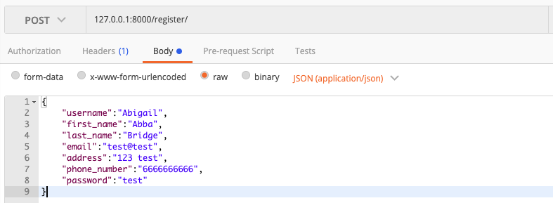
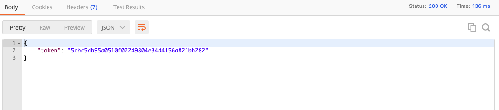
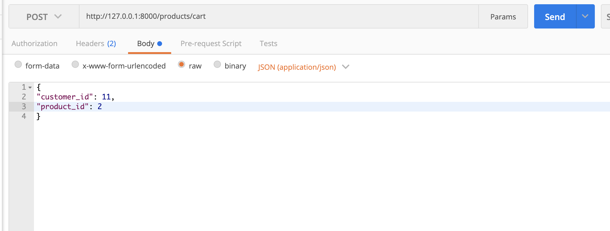
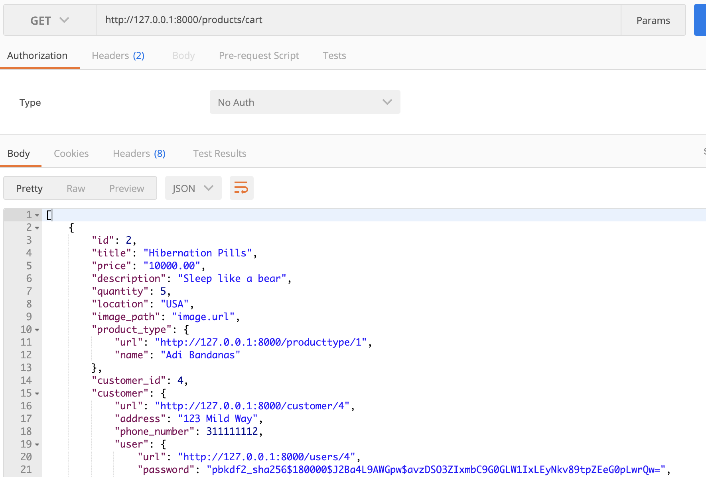

# Bangazon Django REST API

---

A Team Project Built using Python, Django, and the Django REST Framework that ties to our [client-side application](https://github.com/nss-cohort-40/bangazon-ecommerce-client-upperclasstwits)

##### ERD



---

## Launching the Bangazon API

1. Create a new directory in your terminal of choice
1. Clone down the repository by clicking the "Clone or Download" button
1. In your terminal write: `git clone sshKeyGoesHere`
   conversion tool for writers.

---

Now, set up your virtual environment:

1. `python -m venv bangazonEnv`
1. Activate virtual environment:
   * **Mac**
   	* `source ./bangazonEnv/bin/activate`
   * **Windows** Maybe need to use Scripts
   	* `source ./bangazonenv/Scripts/activate`
1. Install dependencies:
   `pip install -r requirements.txt`
1. Run migrations:
   `python manage.py migrate`
1. Create a superuser for your local version of the app:
   `python manage.py createsuperuser`
1. Now Run that Server!
   `python manage.py runserver`

---

#Testing in Postman
The database requires an authorization token in **Headers** to succesfully request data. 1. Generate an authorization token by making a **POST** to `/register/`


Here is a premade value set for customer

```
{
	"username":"Abigail",
	"first_name":"Abba",
	"last_name":"Bridge",
	"email":"test@test",
	"address":"123 test",
	"phone_number":"6666666666",
	"password":"test"
}
```

After **POSTING** a response containing a token key will be provided. Copy the value of that token.



Then go to **Headers** and add the _key_ `Authorization` with the _value_ `Token {paste token here}`

Now you can **GET**, **POST**, **PUT**, and **DELETE** to the following pathways:

- /customer
- /products
- /producttype
- /paymenttype

Now you can **GET**, **POST**, and **DELETE** to the following pathways:
To **POST**

- /products/cart

```In postman, go to URL localhost:8000/products/cart and make a POST. In body, write
{
"customer_id": insert valid customer id,
"product_id": valid product_id
}

```



Change it from a **POST** to a **GET** and hit send. Postman should display that customers "cart" with the product you posted above.



---

TEAM:
* Adrian Garmendia
* Tanner Brainard
* Michelle McLane
* Evan Reynolds
* Leigha Robinson
